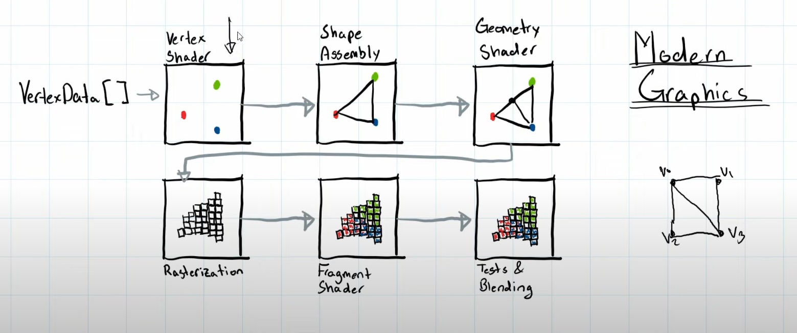
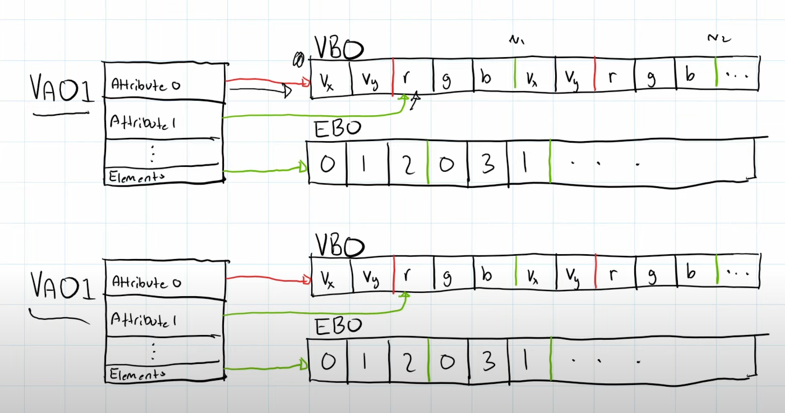

# README.md

## Why this project

## Resource and Credits

## Notes
### Time Calculation
nanotimes = 1 * 10^9ns / 1s; \
second = 1 * 10^-9ns / ns\
Fps = f/s = 1/dt\
Time calculation for deltaTime occurs at the end in case of operation that occurs in between, if 
it happens in between, it could cost lag spike. \
Think of Scene as Unity's different Scene for Editing and Playing ;

### Computer Graphic Pipeline

Vertex Shader is made via program \
Shape Assembly creates shape `GL_LINE` \
Geometry Shader - Programming, but not required \
Rasterization -> Abstract shape to Pixel \
Fragment Shader in charge of color and whacky stuff \
Testing & blending -> See which to render 

Normalize Device Coordinates - Ranging for -1.0f to 1.0f \
VBO - Vertex Buffer Object, contains Vertices with information requires (Attributes you want to be defined) \
GPU requires __VBO__ to defined Offset and Strides, offsets to get to the first attribute, Stride to go to the next vertices \
GPU might require __VAO__ (Vertex Array Objects), contains information regarding vertex attribute \
__EBO__ are Element buffer objects, defining which vertices to draw in what order.

Compilation / Linking -> Compile Fragment shader to Executable for GPU, then Linking it 

### OpenGL Vertex and Fragment shader implementation
First generate and Compile both fragment and vertex shader.
`glCreateShader(GL_TYPE_SHADER)`, `glShaderSource(id, src)`, `glCompileShader(id)` \
Link shaders together to create a program, `glCreateProgram()`, `glAttachShader(id, vertexId)`, `glLinkProgram(id)` \
Generate VAO, VBO, EBO, note offsets are in bytes rather than #s away. You'll have to create FloatBuffer and 
IntBuffer respectively using BufferUtils's functionality. \
During the Update steps, you'll have create and bind program and VAO via `glUseProgram(), glBindVertexArray(), glEnableVertexAttribArray()`, then you can 
draw the elements. After all is done, you'll have to deconstruct everything which is same thing set to `0 (nullptr)`, and disabling the Attribute.
